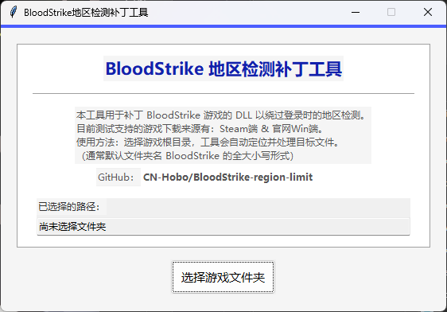

# BloodStrike-region-limit

[](https://github.com/CN-Hobo/BloodStrike-region-limit/stargazers)
[](https://github.com/CN-Hobo/BloodStrike-region-limit/releases)
[](LICENSE)
[]()

> 该项目使用了 AI 协助完成。

## 📖 工具介绍

针对游戏 BloodStrike（译名：血战突袭）PC端登录时提示「由于地区限制暂时无法登录」的解决补丁工具，一个非常简易的 IP 地区检测绕过工具。

在大陆内陆地区裸连亚服仅 40ms 左右延迟，可解决进游戏必须挂加速器的问题。

本补丁工具只涉及登录时的网络请求，不构成任何作弊行为，**不会造成封禁**。



## 🚩 使用方式

按实际情况选择：

- **有 Python 环境**：直接下载 `BloodStrikePatcher.py` 并自行运行
- **无 Python 环境**：下载 [Releases](https://github.com/CN-Hobo/BloodStrike-region-limit/releases/latest) 中的预编译 exe，双击运行

启动后点击「选择游戏文件夹」，选择 BloodStrike 游戏根目录即可。

```
例如：D:\SteamLibrary\steamapps\common\BLOODSTRIKE
```

## ✨ 主要原理

1. 游戏启动时会向 `https://mgbnaeast-g83naxx1ena.unisdk.easebar.com/g83naxx1ena/sdk/` 的 `uni_sauth` 和 `dlc_sync` 发送 POST 请求
2. 请求参数中包含 `aim_info`，其值携带类似 `"country":"CN"` 的信息。当 IP 指向地区为 `CN` 时，游戏提示地区限制无法登录
3. 本工具将 DLL 中的 `aim_info` 标识置空，使游戏无法检测玩家地区，从而实现裸连

## 🚀 环境要求

- Windows
- Python 3.8+

## 🔧 更新日志

### v0.1.0

- **文件夹名不区分大小写** — 不再强制要求 `BLOODSTRIKE` 全大写，自动匹配 `BLOODSTRIKE`、`bloodstrike` 等大小写形式
- **添加官网版本的支持** — 同时查找Steam端的 `NtUniSdkSteam.dll` 和官网Win端的 `NtUniSdkMpayOversea.dll`，自动定位存在的那个
- **文件夹名校验优化** — 当文件夹名不匹配时弹出确认窗口，允许用户选择「仍然继续」。用于官网版安装时重命名过游戏文件夹的用户
- **界面翻新** — 采用浅灰背景 + 白色卡片布局，蓝色 / 红色主题色，Windows 原生主题控件，整体更美观
- **可点击 GitHub 链接** — 界面中的仓库地址支持点击跳转浏览器

### v0.0.1

- 首次发布
- 简易的UI页面
- 仅对Steam端的支持


## ⚠️ 免责声明

- 本程序仅供 **个人学习、技术交流**，禁止用于商业用途
- 因使用本程序导致的任何法律纠纷或损失，**由使用者自行承担**
